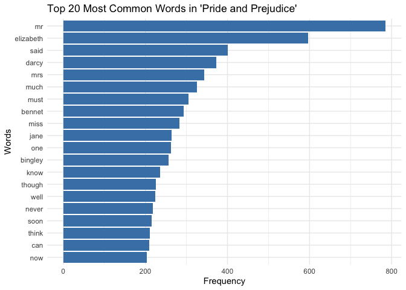

Exercises on String Manipulation and Custom Pig Latin
================

# Exercise 1: Word Frequency Analysis in “Pride and Prejudice”

## Introduction

This exercise involves analyzing a text from Jane Austen’s “Pride and
Prejudice” to identify the most common words, excluding stopwords.

## Load Necessary Packages

References:

- janeaustenr Package: Accessing Jane Austen’s books.
  <https://github.com/juliasilge/janeaustenr>

- stopwords Package: For a predefined list of stop words.
  <https://cran.r-project.org/web/packages/stopwords/readme/README.html>

``` r
# Load the libraries
library(janeaustenr)
library(tidyverse)
```

    ## ── Attaching core tidyverse packages ──────────────────────── tidyverse 2.0.0 ──
    ## ✔ dplyr     1.1.4     ✔ readr     2.1.5
    ## ✔ forcats   1.0.0     ✔ stringr   1.5.1
    ## ✔ ggplot2   3.5.1     ✔ tibble    3.2.1
    ## ✔ lubridate 1.9.3     ✔ tidyr     1.3.1
    ## ✔ purrr     1.0.2     
    ## ── Conflicts ────────────────────────────────────────── tidyverse_conflicts() ──
    ## ✖ dplyr::filter() masks stats::filter()
    ## ✖ dplyr::lag()    masks stats::lag()
    ## ℹ Use the conflicted package (<http://conflicted.r-lib.org/>) to force all conflicts to become errors

``` r
library(tidytext)
library(stopwords)
```

## Load and Prepare the Text

``` r
# Load "Pride and Prejudice" text
book_text <- austen_books() %>%
  filter(book == "Pride & Prejudice") %>%
  select(text)

# Display the first few lines
head(book_text)
```

    ## # A tibble: 6 × 1
    ##   text                 
    ##   <chr>                
    ## 1 "PRIDE AND PREJUDICE"
    ## 2 ""                   
    ## 3 "By Jane Austen"     
    ## 4 ""                   
    ## 5 ""                   
    ## 6 ""

## Tokenize Text and Remove Stop Words

``` r
# Define stop words using the stopwords package (English)
stop_words_custom <- stopwords::stopwords("en")

# Tokenize the text and remove stop words
tidy_words <- book_text %>%
  unnest_tokens(word, text) %>%
  filter(!word %in% stop_words_custom) %>%
  filter(str_detect(word, "^[a-z]+$"))  # Keep only words with letters

# View the tidy words
head(tidy_words)
```

    ## # A tibble: 6 × 1
    ##   word     
    ##   <chr>    
    ## 1 pride    
    ## 2 prejudice
    ## 3 jane     
    ## 4 austen   
    ## 5 chapter  
    ## 6 truth

## Count Word Frequencies

``` r
# Count the most common words
word_counts <- tidy_words %>%
  count(word, sort = TRUE)

# View the top 20 most common words
head(word_counts, 20)
```

    ## # A tibble: 20 × 2
    ##    word          n
    ##    <chr>     <int>
    ##  1 mr          785
    ##  2 elizabeth   597
    ##  3 said        401
    ##  4 darcy       373
    ##  5 mrs         343
    ##  6 much        326
    ##  7 must        305
    ##  8 bennet      294
    ##  9 miss        283
    ## 10 jane        264
    ## 11 one         263
    ## 12 bingley     257
    ## 13 know        236
    ## 14 though      226
    ## 15 well        224
    ## 16 never       218
    ## 17 soon        216
    ## 18 think       211
    ## 19 can         210
    ## 20 now         204

## Plot the Most Common Words

``` r
# Select the top 20 words
top_words <- word_counts %>%
  top_n(20, n) %>%
  arrange(desc(n))

# Plot
ggplot(top_words, aes(x = reorder(word, n), y = n)) +
  geom_bar(stat = "identity", fill = "steelblue") +
  coord_flip() +
  labs(title = "Top 20 Most Common Words in 'Pride and Prejudice'",
       x = "Words",
       y = "Frequency") +
  theme_minimal()
```

<!-- -->

# Exercise 2: Custom Pig Latin Converter

## Function Definition

``` r
# Load necessary library for string manipulation
library(stringr)

#' Convert a Word to Custom Pig Latin
#'
#' This function converts English words to a customized version of Pig Latin.
#' 
#' Rearrangement Rules:
#' - If the word starts with a consonant or consonant cluster, move it to the end.
#' - If the word starts with a vowel, keep it unchanged.
#'
#' Addition Rule:
#' - Append "xyz" to the end of the word after rearrangement.
#'
#' @param word A single word (character string) to be converted.
#' @return A character string representing the word in custom Pig Latin.
#' @examples
#' pig_latin("hello")  # "ellohxyz"
#' pig_latin("apple")  # "applexyz"
#' pig_latin("string") # "ingstrxyz"
#' @export
pig_latin <- function(word) {
  # Input validation
  if (!is.character(word)) {
    stop("Input must be a character string.")
  }
  
  if (length(word) != 1) {
    stop("Input must be a single word.")
  }
  
  if (!str_detect(word, "^[a-zA-Z]+$")) {
    stop("Input must contain only alphabetic characters.")
  }
  
  # Define vowels
  vowels <- c("a", "e", "i", "o", "u")
  
  # Convert word to lowercase for processing
  lower_word <- tolower(word)
  
  # Check if the first letter is a vowel
  if (str_sub(lower_word, 1, 1) %in% vowels) {
    pig_word <- lower_word
  } else {
    # Find the position of the first vowel
    first_vowel_pos <- str_locate(lower_word, "[aeiou]")[1, "start"]
    
    if (is.na(first_vowel_pos)) {
      # No vowels found, treat entire word as consonant cluster
      pig_word <- lower_word
    } else {
      # Move consonant cluster to the end
      pig_word <- str_sub(lower_word, first_vowel_pos, str_length(lower_word)) %>%
        str_c(str_sub(lower_word, 1, first_vowel_pos - 1))
    }
  }
  
  # Append the addition component
  pig_latin_word <- str_c(pig_word, "xyz")
  
  return(pig_latin_word)
}
```

## Examples and Tests

``` r
# Example 1: Word starts with a consonant
pig_latin("hello")   # Output: "ellohxyz"
```

    ## [1] "ellohxyz"

``` r
# Example 2: Word starts with a vowel
pig_latin("apple")   # Output: "applexyz"
```

    ## [1] "applexyz"

``` r
# Example 3: Word with consonant cluster
pig_latin("string")  # Output: "ingstrxyz"
```

    ## [1] "ingstrxyz"

``` r
# I will use use simple assertions to test the function

# Test 1: Word starts with a consonant
stopifnot(pig_latin("hello") == "ellohxyz")

# Test 2: Word starts with a vowel
stopifnot(pig_latin("apple") == "applexyz")

# Test 3: Word with consonant cluster
stopifnot(pig_latin("string") == "ingstrxyz")

# Test 4: Single vowel
stopifnot(pig_latin("a") == "axyz")

# Test 5: No vowels (edge case)
stopifnot(pig_latin("rhythm") == "rhythmxyz")
```
